# ZEST
Zero-Shot Emotion Style Transfer (**Zero Shot Audio to Audio Emotion Transfer With Speaker Disentanglement** accepted at **ICASSP 2024**)

Codes are adapted from [ZEST](https://github.com/iiscleap/ZEST/tree/main)

## Ablations

We perform two ablations where we remove the two CNN-BiLSTM networks operating on the F0 contour and the HuBERT tokens. The results for these cases are provided in the diagram below. Note that there are two more entries (ZEST-no-F0-enc and ZEST-no-unit-enc) in the table than what was provided in the paper.

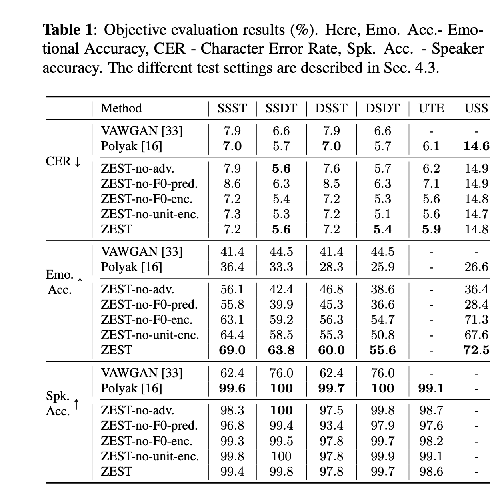</img>

## EASE Embeddings
We first show the utility of the adversarial learning in the speaker embedding module. 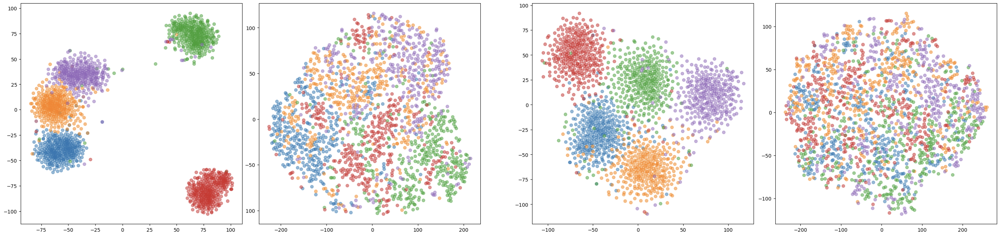</img>

We show the comparison between the **x-vectors**(left of each group) and the **EASE embeddings**(right of each group) side-by-side for two different speakers in ESD dataset. The colours in the t-SNE plots are according to the 5 emotions present in the dataset. We note that x-vectors show clear emotion clusters while EASE embeddings are ignorant of the emotion information. 

## SACE Embeddings
We next show the emotion latent information learnt by the **SACE** module. We show t-SNE visualization of this latent space and colour them based on the 10 speakers and 5 emotions separately.

Emotion clusters             |  Speaker clusters
:-------------------------:|:-------------------------:
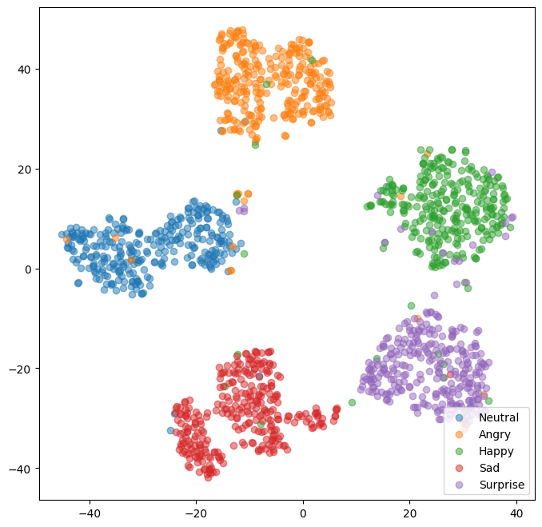</img>|  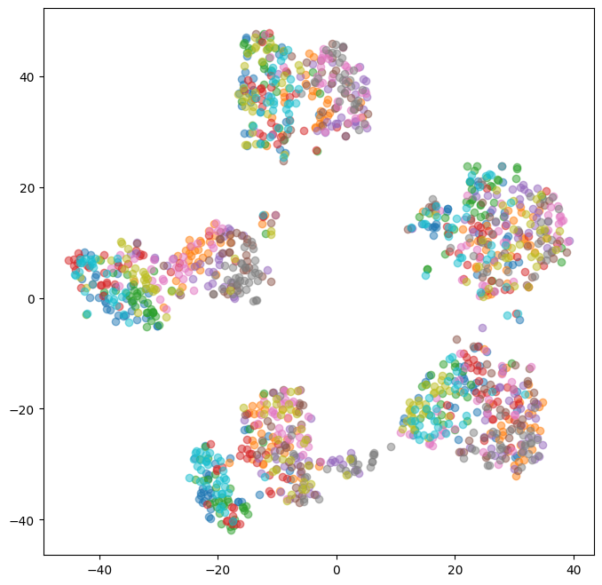</img>

## Reconstruction of F0 contour

We show 4 examples of the ability of the F0 predictor module to reconstruct the ground truth pitch contour.

Angry|  Happy | Sad | Surprise
:-------------------------:|:-------------------------:|:--------------------------:|:---------------------------:|
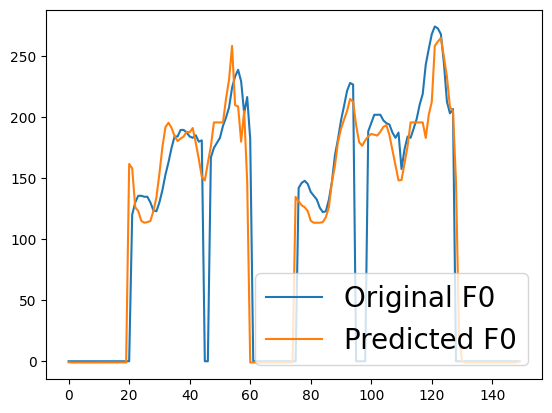</img>|  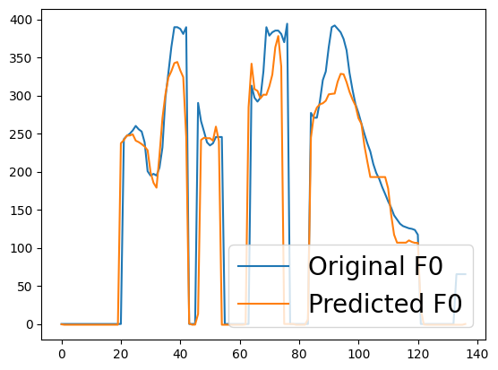</img>|  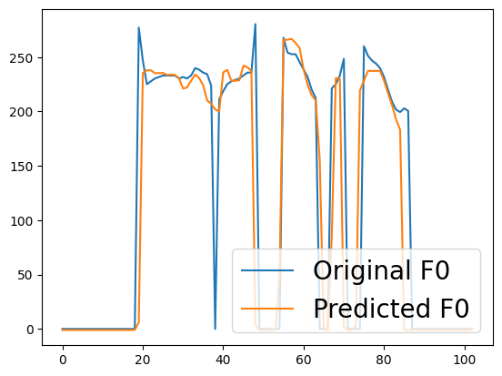</img>|  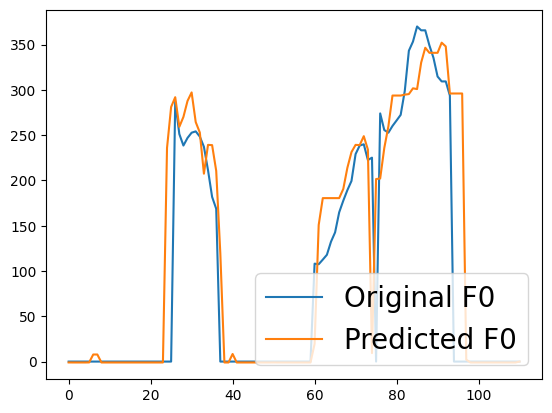</img>

## Examples of F0 conversion

We show three examples of how the F0 conversion works in ZEST. We show three examples from three test settings - DSDT (source and reference speaker seen but different with unseen text), USS (Unseen source speaker with seen reference speaker/emotion and unseen text) and UTE (seen source speaker with unseen reference speaker/emotion and unseen text). The first row indicates the F0 contour of the **source** speech signal, the second row indicates pitch contour of the **reference** speech signal while the last row indicates the **converted** F0 contour.

DSDT|  USS| UTE 
:-------------------------:|:-------------------------:|:--------------------------:|
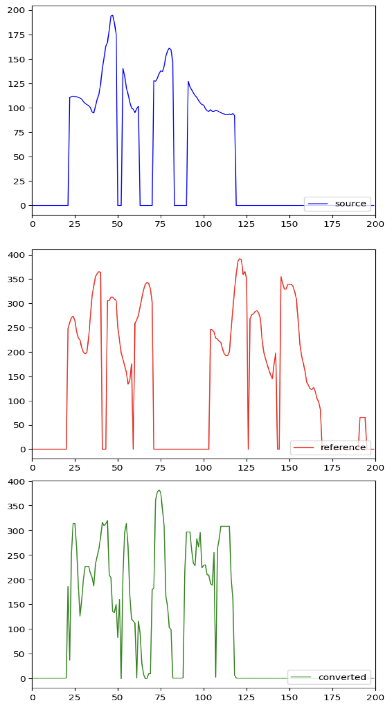</img>|  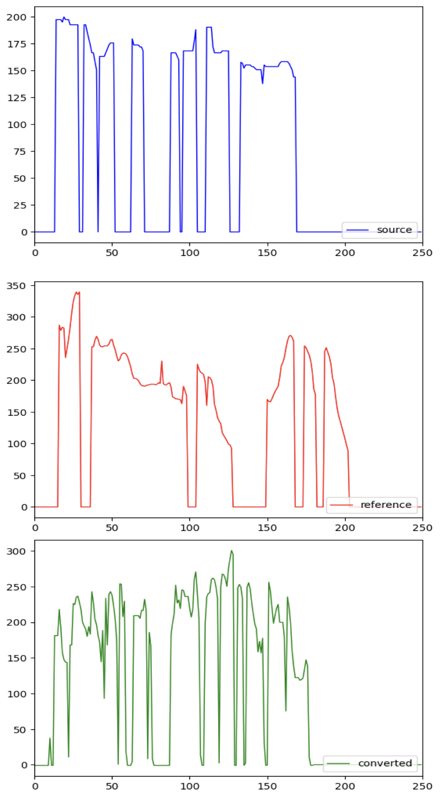</img>|  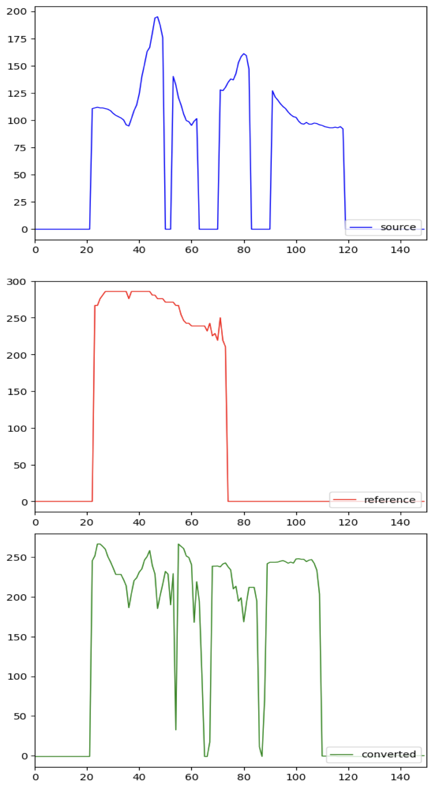</img>

## Training Pipeline

**PLEASE NOTE THAT: ALL CODE SHOULD BE RUN AT BASE FOLDER**

please checking out **code/config.yml**.

1. EASE

	1. run **get_seapker_embedding.py**, get embeddings of ECAPA.
	2. run  **speaker_classifier.py**, train EASE. We provided EASE.pth.

2. SACE

	1. run **get_emotion_embedding.py**, get embeddings of wav2vec2. We freeze all layers in wav2vec2
	2. run  **emotion_classifier.py**, train SACE. We provided SACE.pth.

3. F0

	1. run **pitch_attention_adv.py** in ddp way, training F0_predictor.

		```bash
		python -m torch.distributed.launch --nproc_per_node=4 code/F0_predictor/pitch_attention_adv.py
		```

	2.  reconstruct F0 by **pitch_inference.py**.

4. HiFi-GAN

	1. run **train.py** in ddp way.

		```bash
		python -m torch.distributed.launch --nproc_per_node=4 code/HiFi-GAN/train.py 
		```

## Reconstruct Pipeline

1. run **pitch_convert.py** to get DSDT F0 contours.

2. run **inference.py** in HiFi-GAN.

	```
	python code/HiFi-GAN/inference.py --convert
	```

	